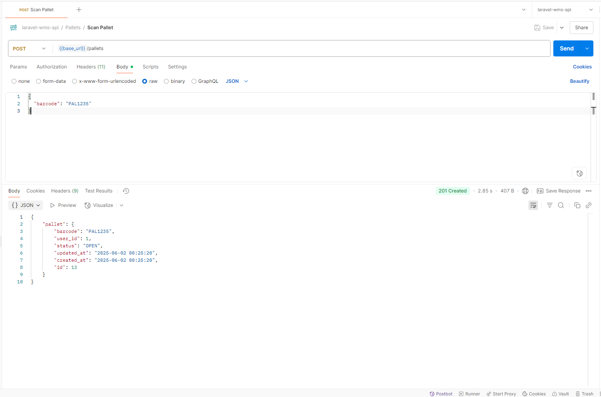
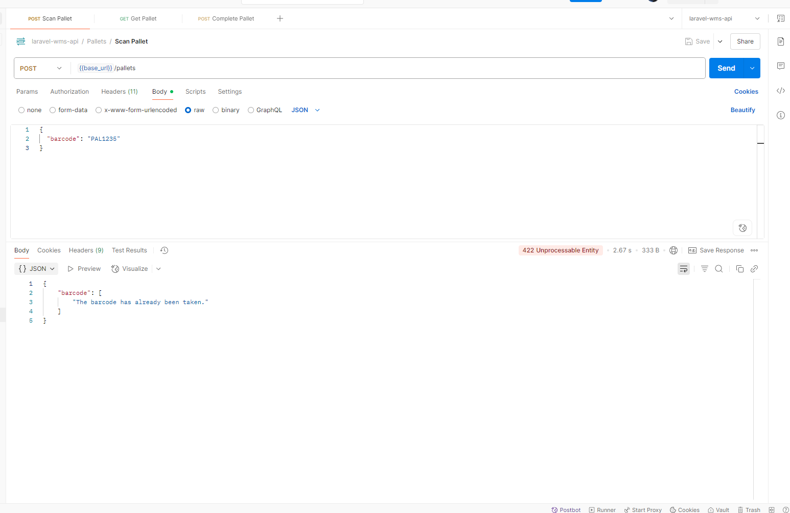
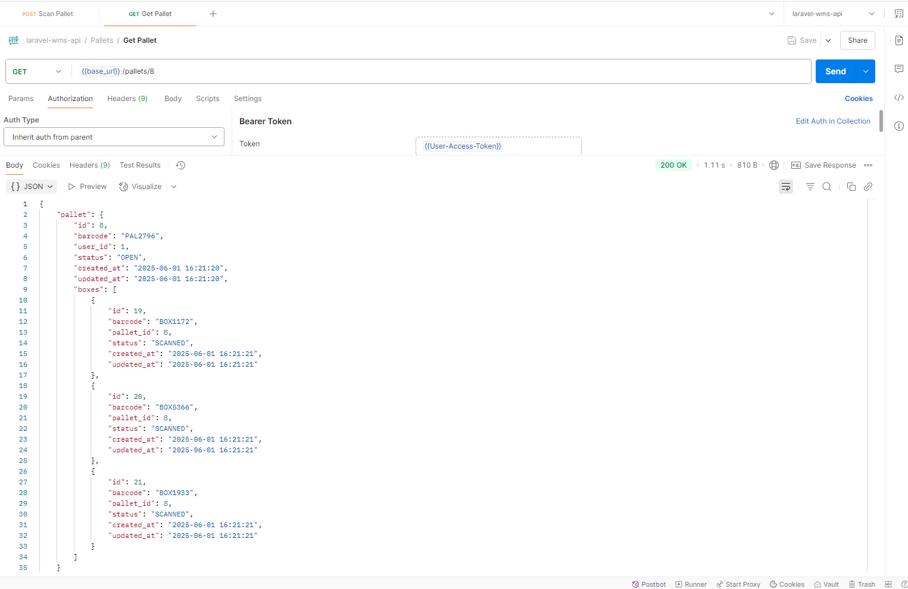
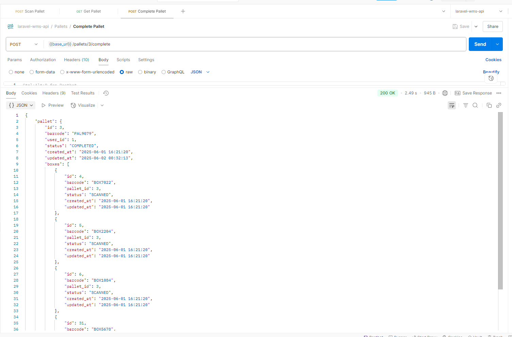
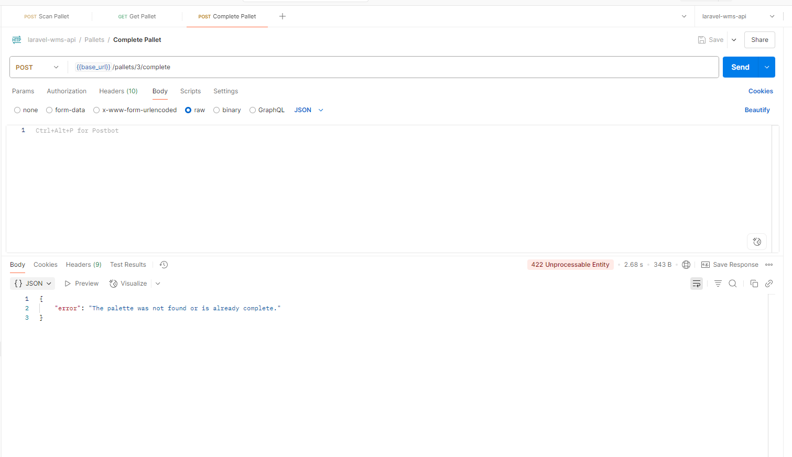
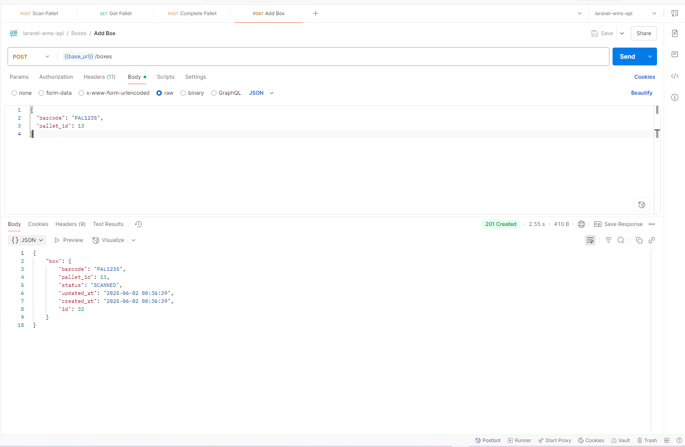
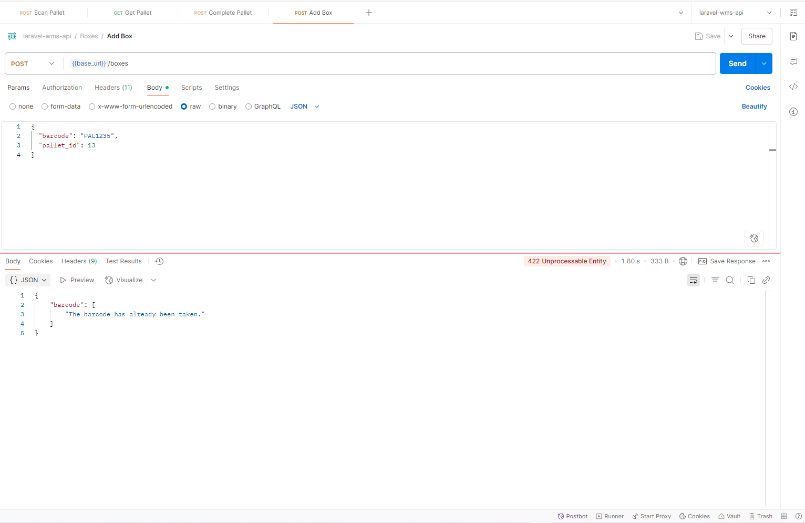
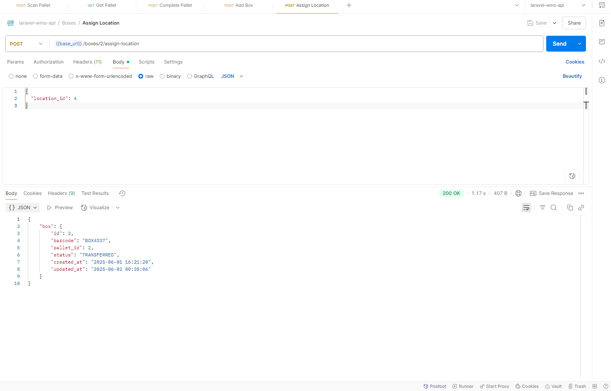
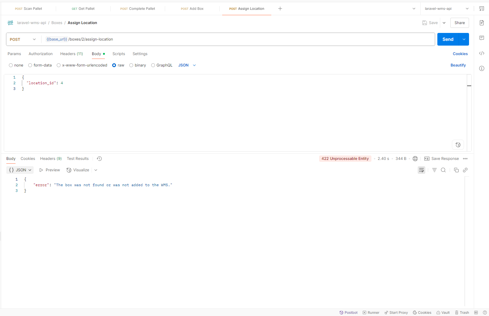

# Laravel WMS API

A robust Warehouse Management System (WMS) API built with Laravel 5.3, featuring Docker containerization for easy deployment and development. This system manages pallets, boxes, locations, and inventory movements with comprehensive tracking capabilities.

## 🚀 Features

- **Authentication System**: API token-based authentication
- **Pallet Management**: Create, track, and complete pallets
- **Box Management**: Scan and assign boxes to pallets
- **Location Management**: Assign locations to boxes for inventory tracking
- **Inventory Movements**: Track all warehouse movements (RECEIVE, PUTAWAY, PICK, TRANSFER)
- **Repository Pattern**: Clean architecture with repository and service layers
- **Docker Support**: Fully containerized development environment

## 📋 Prerequisites

Before you begin, ensure you have the following installed on your system:

- [Git](https://git-scm.com/)
- [Docker](https://www.docker.com/get-started) (v20.0+)
- [Docker Compose](https://docs.docker.com/compose/install/) (v1.29+)

## 🛠 Installation & Setup

### 1. Clone the Repository

```bash
git clone https://github.com/fvarli/laravel-wms-api.git
cd laravel-wms-api
```

### 2. Environment Configuration

Create environment file from example:

```bash
cp .env.example .env
```

Update your `.env` file with the following configuration:

```env
APP_NAME="Laravel WMS API"
APP_ENV=local
APP_KEY=base64:YOUR_APP_KEY_HERE
APP_DEBUG=true
APP_URL=http://localhost

DB_CONNECTION=mysql
DB_HOST=db
DB_PORT=3306
DB_DATABASE=laravel_wms_db
DB_USERNAME=laravel_wms_user
DB_PASSWORD=laravel_wms_pass
DB_ROOT_PASSWORD=root_password

CACHE_DRIVER=file
SESSION_DRIVER=file
QUEUE_DRIVER=sync
```

### 3. Docker Setup

Build and start the containers:

```bash
# Build the Docker images
docker-compose build

# Start the containers in detached mode
docker-compose up -d
```

This will start three containers:
- **app**: PHP 7.4-FPM application server
- **nginx**: Nginx web server (accessible on port 8080)
- **db**: MySQL 5.7 database server (accessible on port 3312)

### 4. Install Dependencies

```bash
# Install PHP dependencies
docker-compose exec laravel-wms-app composer install

# Generate application key
docker-compose exec laravel-wms-app php artisan key:generate
```

### 5. Database Setup

```bash
# Run database migrations
docker-compose exec laravel-wms-app php artisan migrate

# Seed the database with sample data
docker-compose exec laravel-wms-app php artisan db:seed
```

### 6. Verify Installation

The application should now be accessible at: `http://localhost:8080`

Test the API health:
```bash
curl http://localhost:8080/api/auth/user
```

## 📊 Database Schema

### Core Tables

| Table | Description |
|-------|-------------|
| `users` | System users with API authentication |
| `pallets` | Pallet containers for organizing boxes |
| `boxes` | Individual boxes within pallets |
| `locations` | Warehouse storage locations |
| `inventory_movements` | Audit trail of all inventory actions |

### Entity Relationships

```
Users (1) ──→ (N) Pallets
Pallets (1) ──→ (N) Boxes
Boxes (1) ──→ (N) InventoryMovements
Locations (1) ──→ (N) InventoryMovements
```

## 🔐 API Authentication

This API uses token-based authentication. All protected endpoints require an `Authorization` header.

### Login and Get Token

```bash
curl -X POST http://localhost:8080/api/auth/login \
  -H "Content-Type: application/json" \
  -d '{
    "email": "seed@example.com",
    "password": "secret"
  }'
```

Response:
```json
{
  "token": "your-api-token-here"
}
```

### Using the Token

Include the token in subsequent requests:

```bash
curl -H "Authorization: Bearer your-api-token-here" \
     http://localhost:8080/api/auth/user
```

## 📚 API Endpoints

### Authentication Endpoints

| Method | Endpoint | Description | Auth Required |
|--------|----------|-------------|---------------|
| POST | `/api/auth/login` | Login and get API token | No |
| GET | `/api/auth/user` | Get authenticated user info | Yes |
| POST | `/api/auth/logout` | Logout and invalidate token | Yes |

### Pallet Management

| Method | Endpoint | Description | Auth Required |
|--------|----------|-------------|---------------|
| POST | `/api/pallets` | Create a new pallet | Yes |
| GET | `/api/pallets/{id}` | Get pallet details with boxes | Yes |
| POST | `/api/pallets/{id}/complete` | Complete pallet and move boxes to WMS | Yes |

### Box Management

| Method | Endpoint | Description | Auth Required |
|--------|----------|-------------|---------------|
| POST | `/api/boxes` | Create/scan a new box | Yes |
| POST | `/api/boxes/{id}/assign-location` | Assign location to box | Yes |

## 🔄 Workflow Examples

### 1. Complete Receiving Workflow

```bash
# 1. Login
TOKEN=$(curl -s -X POST http://localhost:8080/api/auth/login \
  -H "Content-Type: application/json" \
  -d '{"email": "seed@example.com", "password": "secret"}' \
  | jq -r '.token')

# 2. Create a new pallet
PALLET_ID=$(curl -s -X POST http://localhost:8080/api/pallets \
  -H "Authorization: Bearer $TOKEN" \
  -H "Content-Type: application/json" \
  -d '{"barcode": "PAL001"}' \
  | jq -r '.pallet.id')

# 3. Scan boxes into the pallet
curl -X POST http://localhost:8080/api/boxes \
  -H "Authorization: Bearer $TOKEN" \
  -H "Content-Type: application/json" \
  -d "{\"barcode\": \"BOX001\", \"pallet_id\": $PALLET_ID}"

curl -X POST http://localhost:8080/api/boxes \
  -H "Authorization: Bearer $TOKEN" \
  -H "Content-Type: application/json" \
  -d "{\"barcode\": \"BOX002\", \"pallet_id\": $PALLET_ID}"

# 4. Complete the pallet
curl -X POST http://localhost:8080/api/pallets/$PALLET_ID/complete \
  -H "Authorization: Bearer $TOKEN" \
  -H "Content-Type: application/json"

# 5. Assign locations to boxes (after completion)
BOX_ID=$(curl -s http://localhost:8080/api/pallets/$PALLET_ID \
  -H "Authorization: Bearer $TOKEN" \
  | jq -r '.pallet.boxes[0].id')

curl -X POST http://localhost:8080/api/boxes/$BOX_ID/assign-location \
  -H "Authorization: Bearer $TOKEN" \
  -H "Content-Type: application/json" \
  -d '{"location_id": 1}'
```

---

## 📮 Postman Collection

The project includes a complete Postman collection and environment for testing all API endpoints. You can find these files in:

- Collection: `resources/docs/postman/laravel-wms-api.postman_collection.json`
- Environment: `resources/docs/postman/laravel-wms-api.postman_environment.json`

Import these files into Postman to quickly test the API.

---

## 📸 API Screenshots

Below are screenshots of the API in action using Postman, demonstrating the key WMS functionality:

### Pallet Management

#### Creating a New Pallet

*Screenshot showing successful creation of a new pallet with barcode scanning*

#### Pallet Creation Error Handling

*Screenshot showing validation error when trying to create a pallet with duplicate barcode*

#### Retrieving Pallet Details

*Screenshot showing pallet details retrieval with associated boxes and their current status*

#### Completing a Pallet

*Screenshot showing successful pallet completion, moving all boxes to WMS status*

#### Pallet Completion Error Handling

*Screenshot showing error when trying to complete an already completed pallet*

### Box Management

#### Scanning a New Box

*Screenshot showing successful box scanning and association with a pallet*

#### Box Scanning Error Handling

*Screenshot showing validation error when trying to scan a box with duplicate barcode or invalid pallet*

### Location Assignment

#### Assigning Box to Location

*Screenshot showing successful assignment of a box to a warehouse location (PUTAWAY operation)*

#### Location Assignment Error Handling

*Screenshot showing error when trying to assign location to a box that's not in WMS status*

## 🗂 Project Structure

```
├── app/
│   ├── Http/
│   │   ├── Controllers/Api/     # API Controllers
│   │   └── Requests/           # Form Request Validation
│   ├── Models/                 # Eloquent Models
│   ├── Repositories/           # Repository Pattern Implementation
│   └── Services/              # Business Logic Layer
├── database/
│   ├── migrations/            # Database Migrations
│   ├── seeds/                # Database Seeders
│   └── factories/            # Model Factories
├── docker-compose.yml        # Docker Services Configuration
├── Dockerfile               # PHP Application Container
└── nginx/                   # Nginx Configuration
```

## 🚦 Status Enums

### Pallet Status
- `OPEN`: Pallet is accepting new boxes
- `COMPLETED`: Pallet is complete and boxes moved to WMS
- `CANCELLED`: Pallet operation cancelled

### Box Status
- `SCANNED`: Box has been scanned into system
- `IN_WMS`: Box is in warehouse management system
- `TRANSFERRED`: Box has been assigned to a location

### Movement Types
- `RECEIVE`: Initial receipt of goods
- `PUTAWAY`: Moving goods to storage location
- `PICK`: Picking goods for orders
- `TRANSFER`: Moving goods between locations

## 🐛 Troubleshooting

### Common Issues

**Port Already in Use**
```bash
# Check what's using port 8080
netstat -tulpn | grep :8080

# Or use different ports in docker-compose.yml
ports:
  - "8081:80"  # Change from 8080 to 8081
```

**Permission Issues**
```bash
# Fix file permissions
sudo chown -R $USER:$USER .
chmod -R 755 storage bootstrap/cache
```

**Database Connection Issues**
```bash
# Restart database container
docker-compose restart db

# Check database logs
docker-compose logs db
```

**Clear Application Cache**
```bash
docker-compose exec laravel-wms-app php artisan cache:clear
docker-compose exec laravel-wms-app php artisan config:clear
docker-compose exec laravel-wms-app php artisan route:clear
```

## 🧪 Testing

### Manual API Testing

Use the provided seed data to test the API:

- **Email**: `seed@example.com`
- **Password**: `secret`

### Database Inspection

Connect to the database directly:

```bash
# Connect to MySQL container
docker-compose exec db mysql -u wms_user -p laravel_wms

# Or use external tool with these credentials:
# Host: localhost
# Port: 3312
# Database: laravel_wms
# Username: wms_user
# Password: wms_password
```

## 🔧 Development

### Adding New Features

1. **Models**: Add new Eloquent models in `app/Models/`
2. **Migrations**: Create migrations with `docker-compose exec laravel-wms-app php artisan make:migration`
3. **Controllers**: Add API controllers in `app/Http/Controllers/Api/`
4. **Services**: Implement business logic in `app/Services/`
5. **Repositories**: Add data access layer in `app/Repositories/`

### Useful Commands

```bash
# View container logs
docker-compose logs -f app

# Access application container shell
docker-compose exec laravel-wms-app bash

# Run artisan commands
docker-compose exec laravel-wms-app php artisan [command]

# Composer commands
docker-compose exec laravel-wms-app composer [command]
```

## 📝 Contributing

1. Fork the repository
2. Create a feature branch (`git checkout -b feature/amazing-feature`)
3. Commit your changes (`git commit -m 'Add amazing feature'`)
4. Push to the branch (`git push origin feature/amazing-feature`)
5. Open a Pull Request

## 📄 License

This project is licensed under the MIT License - see the [LICENSE](LICENSE) file for details.

## 🤝 Support

If you encounter any issues or have questions:

1. Check the [Troubleshooting](#-troubleshooting) section
2. Search existing [GitHub Issues](https://github.com/your-username/laravel-wms-api/issues)
3. Create a new issue with detailed information

---

**Built with ❤️ using Laravel 5.3 and Docker**
